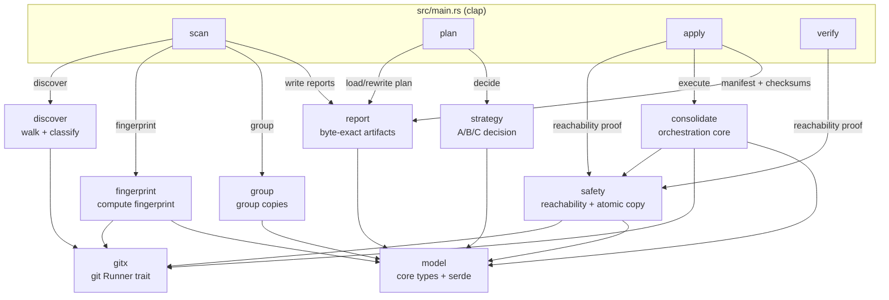
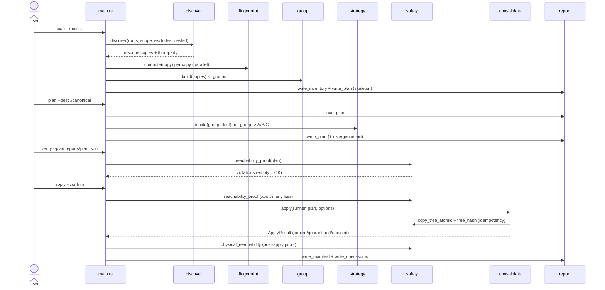
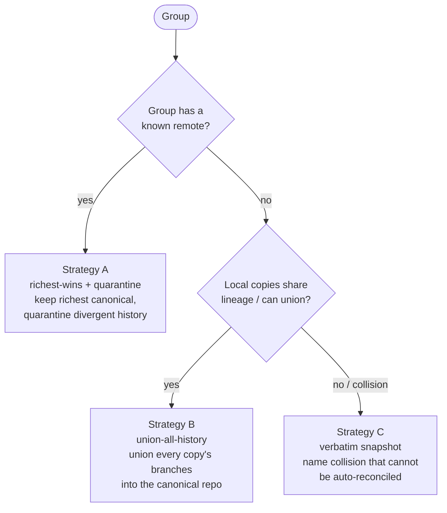

# Architecture
<!-- rev:001 (RFC 3339) 2026-07-22T19:46:58Z -->

`reposmerge` is a faithful 1:1 Rust port of `github.com/inovacc/reposmerge`. The binary (`src/main.rs`, clap) dispatches four subcommands over a library whose modules are declared in strict dependency order (`src/lib.rs`).

## System overview

The CLI subcommands drive the library modules. Each module depends only on modules earlier in the port order.

## Pipeline sequence (scan → plan → apply → verify)

## A/B/C strategy decision

`strategy::decide` picks a per-group consolidation strategy based on whether the group has a known remote and whether its local copies share lineage.

## Module responsibilities

| Module | Responsibility |
|--------|----------------|
| `model` | Core serde types (Copy, Group, Plan, Decision, ApplyResult, StrategyKind, ...) with exact Go JSON keys |
| `gitx` | `Runner` trait wrapping `git` (ExecRunner + Fake for tests) |
| `fingerprint` | Fill a Copy's fingerprint (head, commit counts, branches, lineage) from git output |
| `group` | Group copies into logical repos in first-seen order |
| `discover` | Walk roots, find repos, classify in-scope vs third-party (with optional nested discovery) |
| `report` | Emit byte-exact artifacts: `inventory.csv`, `third-party.csv`, `plan.json`, `divergence.md`, `MANIFEST.md`, `checksums.sha256` |
| `safety` | Static + physical reachability proofs, atomic tree copy with rollback, content tree hash |
| `strategy` | Decide A/B/C per group |
| `consolidate` | Orchestration core: execute a Plan (copy / quarantine / union), idempotent + atomic |
| `app` | Inert mantle-config shim (framework boundary — runtime not reimplemented) |
